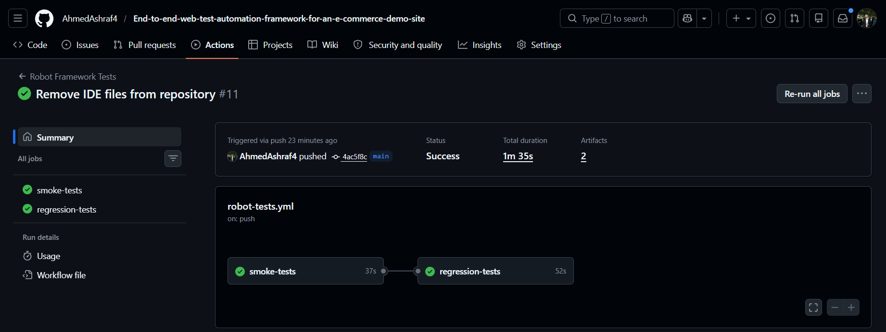
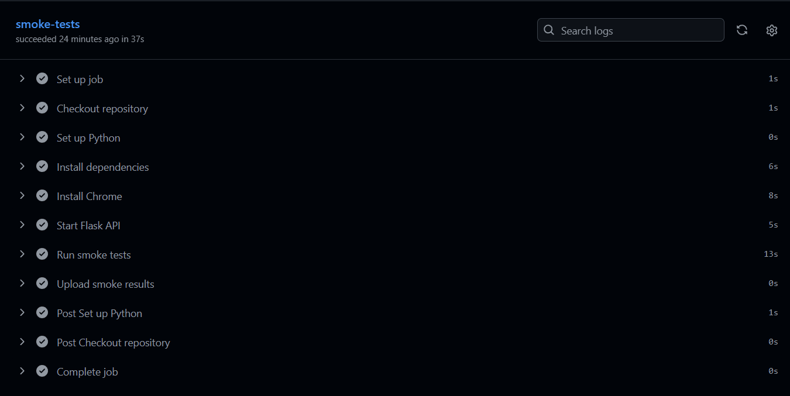
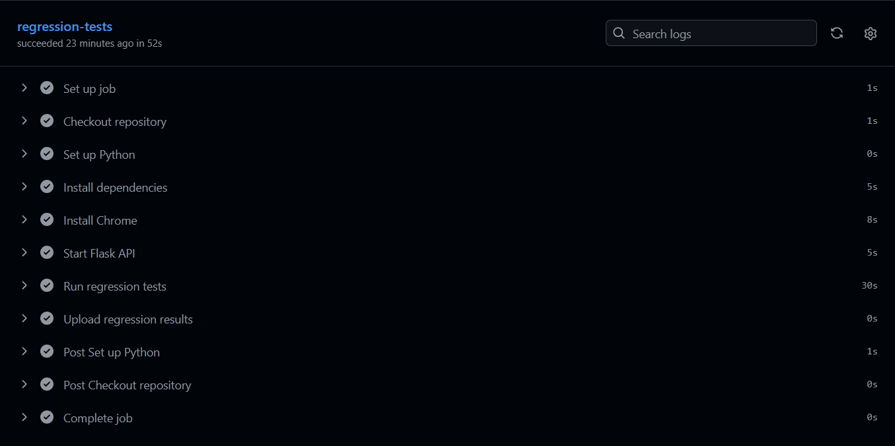
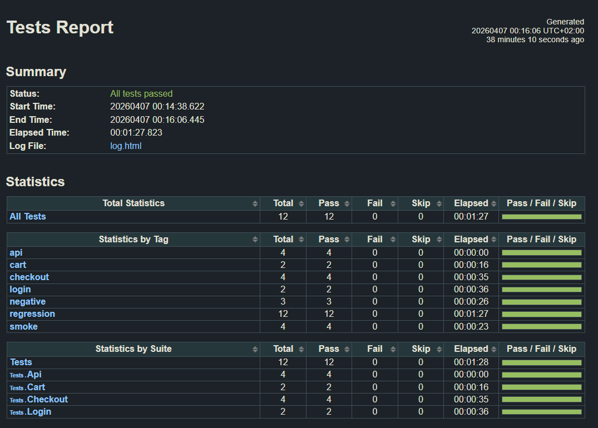
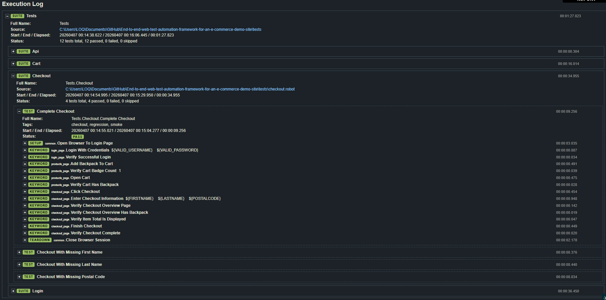
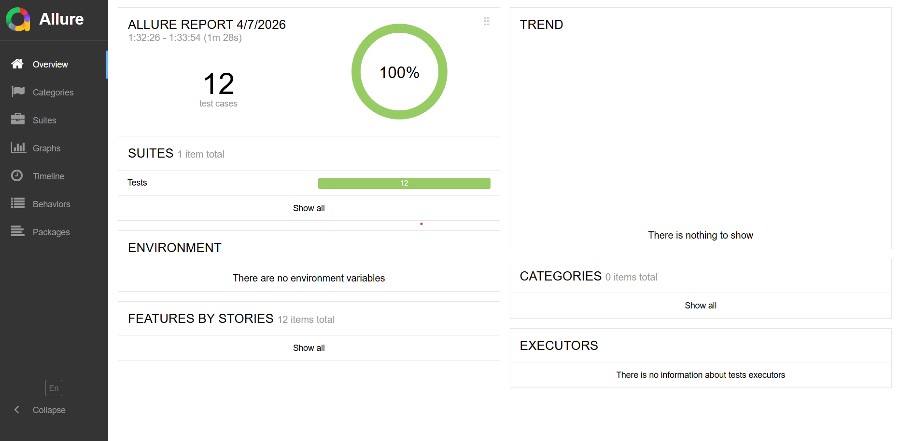
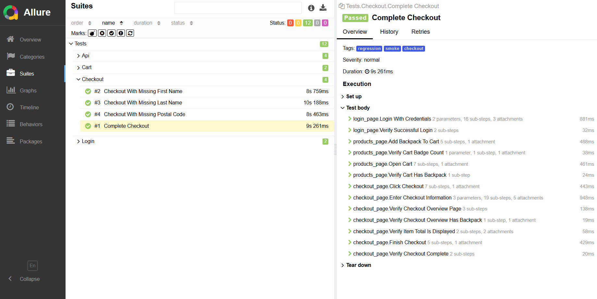

# Robot Framework Test Automation Suite with CI Integration


A modular automation testing framework built with **Robot Framework**, **SeleniumLibrary**, **RequestsLibrary**, **Python**, and **GitHub Actions**.
The project automates critical e-commerce UI workflows on **SauceDemo** and also includes a small **local Flask API** for stable API automation testing.

This project was designed to demonstrate practical QA automation engineering skills including:
- reusable framework design
- UI and API automation
- data-driven testing
- positive and negative test validation
- CI integration
- traceability and documentation
- structured project organization

---

## Project Goals

This framework demonstrates:
- automated UI testing using Robot Framework
- reusable page keywords and locator separation
- Python helper utilities
- data-driven login validation
- negative checkout validation
- API testing with a controlled local service
- smoke and regression test organization
- CI execution through GitHub Actions
- supporting QA documents such as test plans, test cases, bug reports, and a traceability matrix

---

## Tech Stack

- **Robot Framework**
- **SeleniumLibrary**
- **RequestsLibrary**
- **Python**
- **Flask**
- **Chrome**
- **GitHub Actions**
- **Allure Report support**

---

## Features

### UI Automation
- Valid login
- Invalid login
- Locked user login validation
- Missing username validation
- Missing password validation
- Add item to cart
- Remove item from cart
- Complete checkout flow
- Negative checkout validation for missing mandatory fields

### API Automation
- Health check endpoint
- Get all posts
- Get single post
- Create a new post

### Framework Features
- reusable safe-action keywords
- locator separation
- page-based resource organization
- Python helper library
- data-driven login testing from CSV
- environment-specific variable files
- headless CI execution
- screenshot capture on failure
- GitHub Actions automation
- optional Allure reporting

---

## Project Structure

```text
End-to-end-web-test-automation-framework-for-an-e-commerce-demo-site/
├── tests/
│   ├── login.robot
│   ├── cart.robot
│   ├── checkout.robot
│   └── api.robot
│
├── resources/
│   ├── common.robot
│   ├── variables.robot
│   ├── login_page.robot
│   ├── products_page.robot
│   ├── checkout_page.robot
│   ├── dev.py
│   ├── qa.py
│   ├── ci.py
│   └── locators/
│       ├── login_locators.robot
│       ├── products_locators.robot
│       └── checkout_locators.robot
│
├── libraries/
│   └── helpers.py
│
├── data/
│   └── login_data.csv
│
├── docs/
│   ├── test_plan.md
│   ├── test_cases.md
│   ├── bug_reports.md
│   └── traceability_matrix.md
│
├── .github/
│   └── workflows/
│       └── robot-tests.yml
│
├── results/
├── app.py
├── requirements.txt
├── .gitignore
└── README.md
```

---

## Architecture

The project is organized around a reusable framework design:

- **tests/** contains test suites
- **resources/** contains shared Robot Framework resources and page keywords
- **resources/locators/** separates UI locators from page logic
- **libraries/** contains custom Python helper functions
- **data/** contains externalized test data
- **docs/** contains supporting QA documentation
- **app.py** provides a local Flask API for stable API testing
- **.github/workflows/** contains the CI pipeline

This separation improves:
- maintainability
- readability
- scalability
- test organization

---

## Test Types Covered

- Functional UI testing
- Negative validation testing
- API testing
- Smoke testing
- Regression testing

---

## Scenarios Covered

### Login
- Valid login
- Locked user login
- Invalid password
- Missing username
- Missing password

### Cart
- Add item to cart
- Remove item from cart
- Validate cart badge count

### Checkout
- Complete checkout
- Missing first name
- Missing last name
- Missing postal code
- Verify overview page contents
- Verify item total is displayed

### API
- API health check
- Retrieve all posts
- Retrieve one post
- Create a new post

---

## Environment Support

The project supports multiple variable files:

- `resources/dev.py` for local execution
- `resources/qa.py` for alternate environment structure
- `resources/ci.py` for headless CI execution

Example:

```bash
robot --variablefile resources/dev.py -d results tests/
```

---

## Installation

Create and activate a virtual environment if you want:

### Windows PowerShell
```powershell
python -m venv .venv
.venv\Scripts\Activate.ps1
```

### Install dependencies
```bash
pip install -r requirements.txt
```

---

## Requirements

Your `requirements.txt` should include:

```txt
robotframework
robotframework-seleniumlibrary
robotframework-requests
flask
allure-robotframework
```

---

## Running the Local Flask API

Before running API tests, start the Flask app:

```bash
python app.py
```

It will run on:

```text
http://127.0.0.1:5000
```

---

## Run Commands

### Run all tests locally
```bash
robot --variablefile resources/dev.py -d results tests/
```

### Run all tests locally with Allure listener
```bash
robot --variablefile resources/dev.py --listener allure_robotframework -d results tests/
```

### Run smoke tests
```bash
robot --variablefile resources/dev.py -i smoke -d results tests/
```

### Run regression tests
```bash
robot --variablefile resources/dev.py -i regression -d results tests/
```

### Run negative tests
```bash
robot --variablefile resources/dev.py -i negative -d results tests/
```

### Run only API tests
```bash
robot --variablefile resources/dev.py -d results tests/api.robot
```

### Run only UI tests
```bash
robot --variablefile resources/dev.py -e api -d results tests/
```

---

## CI Pipeline

This project uses **GitHub Actions** to automate test execution.

CI workflow features:
- installs Python dependencies
- installs Chrome
- starts the local Flask API
- runs Robot Framework tests in headless mode
- uploads execution results as artifacts

The workflow uses:

```text
resources/ci.py
```

to enable headless browser execution in CI.

---

## Reporting

Robot Framework generates:
- `output.xml`
- `log.html`
- `report.html`

The framework also supports **Allure reporting** through:

```bash
robot --variablefile resources/dev.py --listener allure_robotframework -d results tests/
```

---

## Supporting QA Documentation

The `docs/` folder contains additional QA documentation:

- **test_plan.md**
  Defines project scope, objectives, environment, risks, and test approach.

- **test_cases.md**
  Documents structured manual-style test scenarios with steps and expected results.

- **bug_reports.md**
  Contains sample defect reports showing defect reporting format and QA thinking.

- **traceability_matrix.md**
  Maps test scenarios to automation coverage and implementation files.

---

## Data-Driven Testing

Login validation is supported with external CSV test data:

```text
data/login_data.csv
```

This demonstrates:
- reusable test design
- broader input coverage
- maintainability through externalized test data

---

## Python Helper Library

Custom Python utilities are placed in:

```text
libraries/helpers.py
```

These are used to support:
- data normalization
- postal code validation
- reusable helper logic

This demonstrates basic Python proficiency alongside Robot Framework usage.

---

## Local API Design

A small Flask service is included to provide a stable API testing target without relying on third-party public APIs.

Endpoints:
- `GET /health`
- `GET /posts`
- `GET /posts/1`
- `POST /posts`

This avoids flaky external API dependencies and makes the API suite deterministic.

---
## Screenshots

### GitHub Actions


#### Smoke Tests


#### Regression Tests


### Robot Framework Report

#### Report


#### Log



### Allure Report

#### Dashboard


#### Log


---


